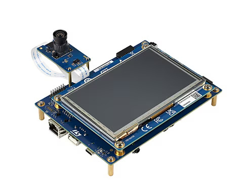

# STM32N6570-DK Board setup with Avnet's X-CUBE package


## 1. Introduction


> [!NOTE]
> The regular process for using the X-CUBE package is to follow this repository's README.md. This document is just a temperary method for using the X-CUBE package with STM32N6 boards and **x-cube-n6-ai-h264-usb-uvc** Application.
> 
## Step 1: Setup the Application
* Download the application **STM32N6_AI_H264_UVC_Application** from ST website and import the project to STM32CubeIDE (v 1.17.0).
* Download the [Avnet-IOTCONNECT.X-CUBE-IoTC-DA16k-PMOD.1.0.0.pack](https://github.com/avnet-iotconnect/I-CUBE-IoTC-DA16k-PMOD/tree/main/pack_project_dir/Files) and unzip it.
* Copy the X-CUBE pack's folder /Drivers/BSP/iotc_da16k_pmod into the project. Add the folder ***PATH*** to the project.
* Follow the instructions to make changes to the application [here](example_main.md).
* Create a local da16k_uart.c in the project's Src folder based on the declarations in the iotc_da16k_pmod/da16k_uart.h.
```
 //EXAMPLE
 
#include "da16k_uart.h"

extern UART_HandleTypeDef huart2;

bool da16k_uart_init(void) {
	//board UART initiliaze (the UART interface which PMOD module connects to)
	return true;
}

void da16k_uart_close(void) {
}

bool da16k_uart_send(const char *src, size_t length) {
	HAL_StatusTypeDef USART_STATUS = HAL_OK;
	USART_STATUS = HAL_UART_Transmit(&huart2, (uint8_t* )src, length, DA16K_UART_TIMEOUT_MS);
	if (USART_STATUS != HAL_OK) {
		return false;
	}
	return true;
}

da16k_err_t da16k_uart_get_char(char *dst, uint32_t timeout_ms) {
	HAL_StatusTypeDef USART_STATUS = HAL_OK;
	USART_STATUS = HAL_UART_Receive(&huart2, (uint8_t* )dst, 1, timeout_ms);

	if (USART_STATUS == HAL_OK) {
		return DA16K_SUCCESS;
	}
	else
		return DA16K_TIMEOUT;
}
```


## Step 2: Create device/template on IOTCONNECT
* An IOTCONNECT Device Template will need to be created or imported. This defines the data format the platform should expect from the device.
  * Download the premade  [Device Template](n6uvc_template.JSON) (Right-click, Save As)
  * **Click** the Device icon and the "Device" sub-menu.
  * At the bottom of the page, select the "Templates" icon from the toolbar and import the template.
* IOTCONNECT Device Creation:
  * **Click** the Device icon and the "Device" sub-menu:
  * At the top-right, click on the "Create Device" button:
  * Enter the **DUID** saved from earlier in the *Unique ID* field
  * Select the template from the dropdown box that was just imported ("n6uvc")
  * Ensure "Auto-generated (recommended)" is selected under *Device certificate*
  * Click **Save & View**
  * Download the device credentials from **Connection Info** (on the right side of webpage when you select the device)
  * The Company ID (**CPID**) and Environment (**ENV**) variables identifying your IOTCONNECT account are required and they are loacted in the "Settings" -> "Key Vault" section of the platform.
  * You have all the information for step 3.
  
## Step 3: Flash/Configure the DA16k PMOD module
Follow the instructions in the [QuickStart Guide](https://github.com/avnet-iotconnect/iotc-dialog-da16k-sdk/blob/main/doc/QUICKSTART.md) to flash the DA16k PMOD.

## Step 2: Debug/Run the Applicaton
* Connect both USB Type-C ports to the computer. One is for debugging and the other is for the power.
* Connect the camera via the ribbon cable to the board.
* Connect the DA16k PMOD module to the board via [jumper wires](https://www.newark.com/multicomp-pro/mp006283/jumper-wire-kit-male-to-female/dp/15AJ6557) (pins are listed in the table below) or a PMOD connector/adapter.
> [!NOTE]
> External 5V power source might need to power the DA16k PMOD module since the available pins on STM32N6570-DK cannot provide enough current.

| PMOD Connector pin # |     Signal      |             
|:--------------------:|:---------------:| 
|          2           |   to HOST_TXD   | 
|          3           |   to HOST_RXD   | 
|       5  or 11       |       GND       |
|       6  or 12       | VCC (3V3 or 5V) |

* `Debug` the project and `Start`.
* Launch the camera via N6CamViwer or ffplay.
