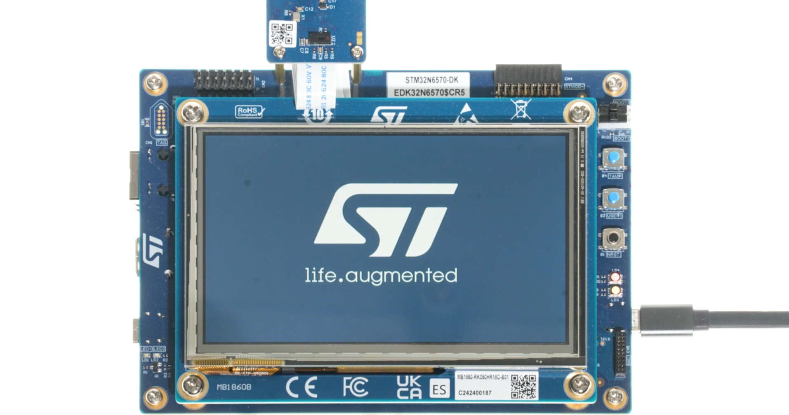

# STM32N6570-DK Board setup with Avnet's X-CUBE package


> [!NOTE]
> The regular process for using the X-CUBE package is to follow this repository's README.md. This document is just a temperary method for using the X-CUBE package with STM32N6 boards and **STM32N6_AI_H264_UVC_Application**.
> 
## Step 1: Setup the Application
* Download the application **STM32N6_AI_H264_UVC_Application** from ST website and import the project to STM32CubeIDE (v 1.16.0).
* Download the [Avnet-IOTCONNECT.X-CUBE-IoTC-DA16k-PMOD.1.0.0.pack](https://github.com/avnet-iotconnect/I-CUBE-IoTC-DA16k-PMOD/tree/main/pack_project_dir/Files) and unzip it.
* Copy the X-CUBE pack's folder /Drivers/BSP/iotc_da16k_pmod into the project. Add the folder ***PATH*** to the project.
* Create a local da16k_uart.c in the project's Src folder based on the declarations in the iotc_da16k_pmod/da16k_uart.h.
```
 //EXAMPLE
 
#include "da16k_uart.h"

extern UART_HandleTypeDef huart2;

bool da16k_uart_init(void) {
	//board UART initiliaze (the UART interface which PMOD module connects to)
	return true;
}

void da16k_uart_close(void) {
}

bool da16k_uart_send(const char *src, size_t length) {
	HAL_StatusTypeDef USART_STATUS = HAL_OK;
	USART_STATUS = HAL_UART_Transmit(&huart2, (uint8_t* )src, length, DA16K_UART_TIMEOUT_MS);
	if (USART_STATUS != HAL_OK) {
		return false;
	}
	return true;
}

da16k_err_t da16k_uart_get_char(char *dst, uint32_t timeout_ms) {
	HAL_StatusTypeDef USART_STATUS = HAL_OK;
	USART_STATUS = HAL_UART_Receive(&huart2, (uint8_t* )dst, 1, timeout_ms);

	if (USART_STATUS == HAL_OK) {
		return DA16K_SUCCESS;
	}
	else
		return DA16K_TIMEOUT;
}
```


## Step 2: Debug/Run the Applicaton
* Connect both USB Type-C ports to the computer. One is for debugging and the other is for the power.
* Connect the camera via the ribbon cable to the board.
* Connect the DA16k PMOD module to the board via an adapter(PMOD to Arduino adapter. e.x. [PMOD Shield](https://www.digikey.com/en/product-highlight/d/digilent/pmod-shield-adapter-board)) or [jumper wires](https://www.newark.com/multicomp-pro/mp006283/jumper-wire-kit-male-to-female/dp/15AJ6557) (pins are listed in the table below).


| PMOD Connector pin # |      Signal       |             
|:--------------------:|:-----------------:| 
|          2           |        TXD        | 
|          3           |        RXD        | 
|       5  or 11       |        GND        |
|       6  or 12       |  VCC (3V3 or 5V)  |

* `Debug` the project and `Start`.
* Launch the camera via N6CamViwer or ffplay.